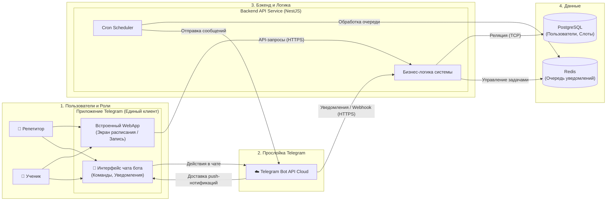

# Кейс: Telegram-бот для автоматизации расписания репетиторов

## 📝 Общее описание проекта и выявление болей

**Предыстория:** Идея проекта родилась из реальной проблемы моей подруги, которая работает репетитором по английскому языку. У неё около 15 активных учеников в неделю. Я заметила, сколько времени она тратит на рутину, и решила провести небольшое интервью (custdev), чтобы разложить её «боли» на четкие технические требования.

### Боли пользователя (Бизнес-проблемы):
1. **Административный хаос:** Согласование времени проходит в трёх разных мессенджерах. Ей приходится вручную сверяться со своим календарем, из-за чего возникают накладки (double-booking). На рутину уходит до 4 часов в неделю.
2. **Финансовые потери (No-Show):** Ученики (особенно подростки) периодически забывают про занятия. Подруга теряет деньги за забронированный слот, так как отмена происходит за 10 минут до урока, когда найти замену уже невозможно.
3. **Неловкость в коммуникации:** Ей психологически некомфортно каждый раз напоминать взрослым людям об оплате или о том, что «отменять урок в последний момент нельзя».

**Решение:** Спроектировать Telegram-бот, который возьмет всю коммуникацию, проверку занятости и жесткие бизнес-правила на себя, выступая в роли «непредвзятого виртуального ассистента».

**Бизнес-цели:**
* Сократить время административной рутины репетитора с 4 часов до 0.
* Защитить доход преподавателя за счет автоматических напоминаний и блокировки поздних отмен.

## Архитектура системы и Data Flow

Взаимодействие компонентов системы, интеграция с внешним **Telegram Bot API**, работа планировщика задач (Cron) и распределение данных по СУБД спроектированы следующим образом:

---
