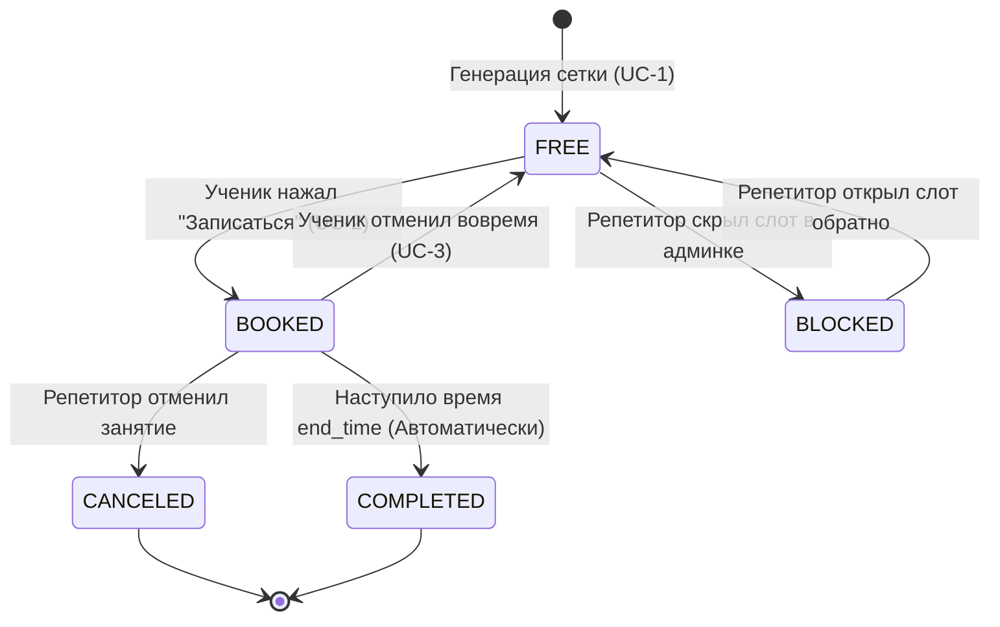

# Реестр бизнес-правил (Business Rules) | Telegram-бот для репетиторов

В данном документе зафиксированы глобальные правила, ограничения и алгоритмы системы бронирования, которые применяются сквозным образом во всех пользовательских сценариях.

---

## BR-01: Единый формат хранения времени (UTC)

### Описание
Все временные метки (`timestamps`) в базе данных системы должны храниться строго в едином стандарте времени **UTC (Coordinated Universal Time)**. 

### Обоснование
Репетитор и ученики могут находиться в разных географических локациях и часовых поясах (например, преподаватель в Минске UTC+3, ученик в Берлине UTC+1). Хранение локального времени в БД приведет к конфликтам при расчете расписания и отправке уведомлений.

### Алгоритм работы (Матчинг таймзон)
1. **При сохранении (Запись в БД):**
   * Когда Репетитор генерирует слоты в своем интерфейсе на 15:00 (по часовому поясу `Europe/Minsk`, UTC+3), бэкенд-сервис (NestJS) считывает таймзону из профиля пользователя (`USERS.timezone`).
   * Перед записью в таблицу `TIME_SLOTS` время конвертируется в UTC: `15:00 - 3 часа = 12:00 UTC`.
2. **При отображении (Чтение из БД):**
   * Когда Ученик из Берлина (`Europe/Berlin`, UTC+1) запрашивает свободные слоты, система берет из БД значение `12:00 UTC`.
   * Бэкенд конвертирует время в таймзону ученика: `12:00 UTC + 1 час = 13:00`. Ученик видит в боте кнопку «13:00», что корректно соответствует 15:00 по Минску.

---

## BR-02: Ограничение времени автоматической отмены занятия

### Описание
Ученик имеет право отменить запланированное занятие в одностороннем порядке через интерфейс бота без штрафных санкций только в том случае, если до начала занятия осталось **более 3 часов** (180 минут).

### Обоснование
Защита финансовых интересов и рабочего графика преподавателя. При отмене менее чем за 3 часа репетитор физически не успеет найти замену на освободившийся слот.

### Техническая логика валидации
* При попытке вызова метода отмены `POST /api/v1/slots/{slot_id}/cancel` бэкенд вычисляет дельту времени:
  `Δ = TIME_SLOTS.start_time - CURRENT_TIMESTAMP (UTC)`
* **Условие успешности:** Если Δ ≥ 180 минут, запрос одобряется, статус меняется на `FREE`.
* **Условие отказа:** Если Δ < 180 минут, система блокирует транзакцию, возвращает ошибку `409 Conflict` с кодом `ERR_LATE_CANCELLATION` и отправляет интерфейсный текст с отказом.

---

## BR-03: Правила генерации и валидации сетки слотов

### Описание
При создании репетитором новых временных интервалов система должна гарантировать целостность расписания и отсутствие накладок.

### Правила валидации:
1. **Запрет на прошлое:** Нельзя создавать слоты, время начала которых меньше текущего времени (`start_time > CURRENT_TIMESTAMP`).
2. **Запрет на пересечение:** Новый создаваемый слот (start_new, end_new) не должен пересекаться ни с одним существующим слотом (start_old, end_old) данного репетитора в статусах `BOOKED` или `BLOCKED`.
   * *Математическое условие пересечения:* `start_new < end_old AND end_new > start_old`.
3. **Статус по умолчанию:** Все успешно прошедшие валидацию новые слоты создаются строго со статусом `FREE` и `student_id = NULL`.

---

## BR-04: Управление очередью уведомлений (Retry Policy)

### Описание
Система гарантирует отправку напоминания о занятии за 2 часа до его начала. В случае технических сбоев внешнего Telegram API применяется политика повторных попыток.

### Логика обработки статусов в `NOTIFICATION_QUEUE`:
* **PENDING:** Новое уведомление, ожидает своего времени отправки (`send_at`).
* **SENT:** Успешно отправлено (Telegram API вернул статус `200 OK`). Запись архивируется.
* **FAILED_BLOCKED:** Терминальный статус ошибки. Возникает, если Telegram API вернул `403 Forbidden` (ученик заблокировал бота). Система прекращает любые повторные попытки отправки для этого пользователя, чтобы не тратить ресурсы.
* **Сетевой сбой (Timeout / 5xx):** Если Telegram API недоступен, запись **остается в статусе `PENDING`**. На следующем тике Cron-планировщика (через 5 минут) система совершит повторную попытку отправки. Максимальное количество попыток — 3, после чего статус переходит в `FAILED_TIMEOUT`.

---

## BR-05: Жизненный цикл и матрица переходов состояний занятия (State Machine)

### Описание
Каждое занятие (временной слот в таблице `TIME_SLOTS`) на протяжении своего существования строго следует определенному жизненному циклу. Переход из одного статуса в другой возможен только при наступлении конкретных системных или пользовательских триггеров.

### Список статусов:
*   **FREE (Свободен):** Слот создан репетитором, доступен для бронирования учениками. `student_id` равен `NULL`.
*   **BOOKED (Забронирован):** Ученик успешно записался на это время. Слот закреплен за ним, ожидает наступления времени урока.
*   **BLOCKED (Заблокирован):** Репетитор временно скрыл этот слот из общего доступа (например, решил устроить перерыв), записаться на него нельзя.
*   **COMPLETED (Завершено):** Время занятия успешно прошло. Статус проставляется автоматически планировщиком по истечении времени `end_time`.
*   **CANCELED (Отменено):** Занятие было отменено учеником (в рамках правил `BR-02`) или самим репетитором.

### Диаграмма состояний занятия (State Machine)
👉 [Сценарии использования](./cases/tutor-scheduler-bot/user-cases.md)

### Матрица валидации переходов (Бизнес-валидация на бэкенде)
Перед каждым изменением статуса бэкенд обязан проверить текущий статус записи. Если переход не разрешен матрицей, система возвращает ошибку `409 Conflict`.

| Текущий статус | Переход в FREE | Переход в BOOKED | Переход в BLOCKED | Переход в COMPLETED | Переход в CANCELED |
| :--- | :--- | :--- | :--- | :--- | :--- |
| **FREE** | ❌ Не имеет смысла |  Разрешено (Запись) |  Разрешено (Скрыть) | ❌ Невозможно | ❌ Невозможно |
| **BOOKED** |  Разрешено (Отмена учеником) | ❌ Нельзя перезаписать | ❌ Сначала отмена |  Разрешено (Урок прошел) |  Разрешено (Отмена репетитором) |
| **BLOCKED** |  Разрешено (Открыть) | ❌ Нельзя записаться | ❌ Уже заблокирован | ❌ Невозможно | ❌ Невозможно |
| **COMPLETED** | ❌ Архивный статус | ❌ Архивный статус | ❌ Архивный статус | ❌ Уже завершено | ❌ Нельзя отменить прошлое |
| **CANCELED** | ❌ Архивный статус | ❌ Архивный статус | ❌ Архивный статус | ❌ Невозможно | ❌ Уже отменено |
