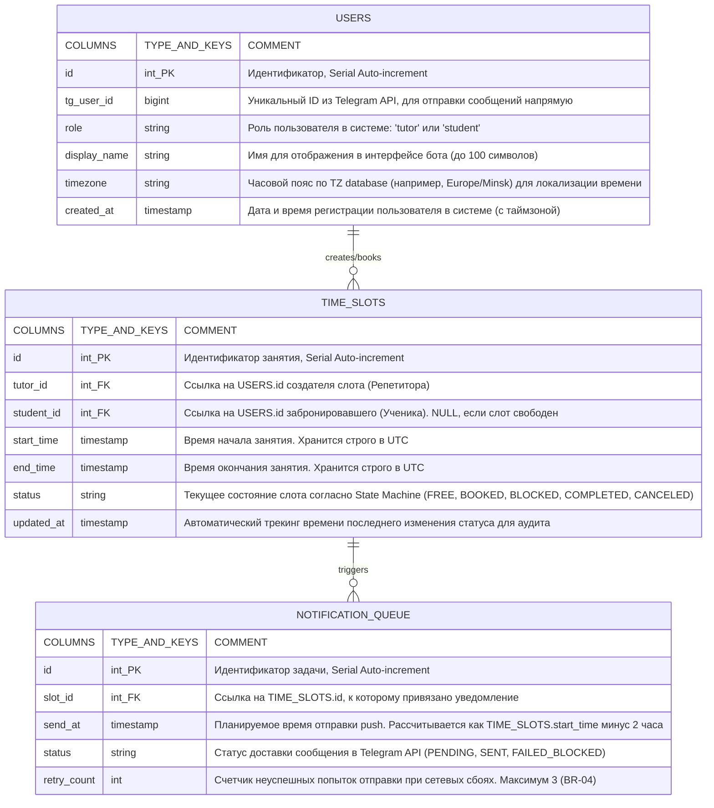

### ER-диаграмма базы данных

```mermaid
erDiagram
    USERS ||--o{ TIME_SLOTS : "creates/books"
    TIME_SLOTS ||--o{ NOTIFICATION_QUEUE : "triggers"

    USERS {
        COLUMNS TYPE_AND_KEYS "COMMENT"
        id int_PK "Идентификатор, Serial Auto-increment"
        tg_user_id bigint "Уникальный ID из Telegram API, для отправки сообщений напрямую"
        role string "Роль пользователя в системе: 'tutor' или 'student'"
        display_name string "Имя для отображения в интерфейсе бота (до 100 символов)"
        timezone string "Часовой пояс по TZ database (например, Europe/Minsk) для локализации времени"
        created_at timestamp "Дата и время регистрации пользователя в системе (с таймзоной)"
    }

    TIME_SLOTS {
        COLUMNS TYPE_AND_KEYS "COMMENT"
        id int_PK "Идентификатор занятия, Serial Auto-increment"
        tutor_id int_FK "Ссылка на USERS.id создателя слота (Репетитора)"
        student_id int_FK "Ссылка на USERS.id забронировавшего (Ученика). NULL, если слот свободен"
        start_time timestamp "Время начала занятия. Хранится строго в UTC"
        end_time timestamp "Время окончания занятия. Хранится строго в UTC"
        status string "Текущее состояние слота согласно State Machine (FREE, BOOKED, BLOCKED, COMPLETED, CANCELED)"
        updated_at timestamp "Автоматический трекинг времени последнего изменения статуса для аудита"
    }

    NOTIFICATION_QUEUE {
        COLUMNS TYPE_AND_KEYS "COMMENT"
        id int_PK "Идентификатор задачи, Serial Auto-increment"
        slot_id int_FK "Ссылка на TIME_SLOTS.id, к которому привязано уведомление"
        send_at timestamp "Планируемое время отправки push. Рассчитывается как TIME_SLOTS.start_time минус 2 часа"
        status string "Статус доставки сообщения в Telegram API (PENDING, SENT, FAILED_BLOCKED)"
        retry_count int "Счетчик неуспешных попыток отправки при сетевых сбоях. Максимум 3 (BR-04)"
    }
```
